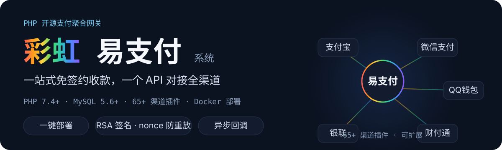

<p align="center">
  
</p>

# 彩虹易支付系统

**彩虹易支付系统** 由郑州追梦网络科技有限公司开发，是一款开源的免签约支付产品，能够帮助开发者一站式接入支付宝、微信、财付通、QQ钱包等多种支付方式，实现高效的支付集成。

<p align="center">
  
</p>

---

## 功能特色

- **多渠道支付集成**：支持支付宝、微信、财付通、QQ钱包、微信WAP、银联、抖音支付等 65+ 支付渠道插件，即插即用
- **完整的 API 接口**：支付下单、订单查询、退款、转账代付、异步回调，支持 MD5 / RSA 双签名
- **后台管理和数据统计**：支付统计、代付统计、利润分析等多种后台管理功能
- **安全可靠**：RSA 公私钥验证、nonce 防重放、风控检测、IP 黑白名单、支付地区限制
- **插件扩展**：`plugins/` 目录即插即用，新增渠道无需改动核心代码
- **移动端优化**：手机版支付页面，支持扫码支付、H5 支付、小程序等场景

---

## 快速开始

### Docker 一键部署

```bash
git clone https://github.com/maajiko/Epay.git
cd Epay
cp .env.example .env        # 修改数据库密码、SITE_URL 等
docker compose up -d        # 启动 nginx + php + mysql + cron 四容器
```

启动后访问站点 → 自动完成初始化安装 → 登录后台（账号 `admin`，密码为 `.env` 中的 `ADMIN_PASSWORD`）→ 添加商户，获取**商户ID**与**商户密钥**。完整部署指南见 [DEPLOY.md](DEPLOY.md)。

### 商户接入（发起一笔支付）

```php
<?php
$key = '商户密钥';  // 后台获取

$params = [
    'pid'          => '1000',                  // 商户ID
    'type'         => 'alipay',                // 支付方式：alipay / wxpay / qqpay ...
    'out_trade_no' => '20260802001',           // 商户订单号
    'notify_url'   => 'https://your-site.com/notify.php', // 异步通知地址
    'return_url'   => 'https://your-site.com/return.php', // 跳转通知地址
    'name'         => '测试商品',
    'money'        => '1.00',
    'timestamp'    => time(),                  // 10 位时间戳（后台可关闭校验以兼容老平台）
    'sign_type'    => 'MD5',
];

ksort($params);                                 // 1. 按字段名升序排序
$signStr = '';
foreach ($params as $k => $v) {
    if ($v === '' || $k === 'sign' || $k === 'sign_type') continue;
    $signStr .= $k . '=' . $v . '&';
}
$params['sign'] = md5(rtrim($signStr, '&') . $key); // 2. 拼接签名串 + 商户密钥

header('Location: https://pay.your-domain.com/api/pay/submit?' . http_build_query($params)); // 3. 发起支付
```

### 接收异步通知

支付成功后，系统会向 `notify_url` 发起异步通知，商户需**验签后**再更新订单状态，并响应 `success` 字符串。

---

## 接口概览

| 功能 | 接口 | 说明 |
| --- | --- | --- |
| 页面跳转支付 | `/api/pay/submit` | 表单或 URL 跳转发起支付，不传 `type` 跳转收银台 |
| 统一下单 | `/api/pay/create` | 创建支付订单（JSON API） |
| 订单查询 | `/api/pay/query` | 查询订单状态 |
| 支付结果通知 | `notify_url` 回调 | 异步通知，需验签 |
| 订单退款 | `/api/pay/refund` | 订单退款 |
| 转账代付 | `/api/transfer/submit` | 发起转账 |
| 商户信息 | `/api/merchant/info` | 查询商户信息 |

> 完整接口文档与签名规则详见部署后的开发文档（`/doc/`）。

---

## 项目结构

```
├── includes/       # 核心类库（支付、订单、API、插件加载）
├── plugins/        # 65+ 支付渠道插件
├── admin/          # 平台管理后台
├── user/           # 商户自助平台
├── paypage/        # 支付页面（扫码、H5）
├── template/       # 前端主题（11 套）
├── install/        # 安装向导与数据库脚本
├── api.php         # 商户 API 入口
├── mapi.php        # 统一下单入口
└── cron.php        # 定时任务（结算、对账）
```

---

## 部署方式

- **Docker**：`docker compose up -d`（开发）或 `docker-compose.prod.yml`（生产），支持 AMD64 / ARM64 多架构镜像
- **传统 LAMP/LEMP**：上传源码 → 配置 `config.php` → 访问 `/install/` 完成安装 → 配置 URL 重写

详细步骤、环境变量参考与常见问题见 [DEPLOY.md](DEPLOY.md)。

---

## 更新日志

### 2026/08/02
1. 新增部署自定义支持：API 接口 timestamp 校验开关，可兼容不传 timestamp 的老平台（后台「系统设置 → 支付相关 → API接口校验timestamp」，或 config.php 定义常量 `API_TIMESTAMP_CHECK` 覆盖）

### 2026/02/28
1. 新增 H5 跳转微信小程序客服支付  

### 2026/02/23
1. 新增抖音支付  
2. 部分间连支付分账规则支持选择实时和延迟分账  
3. 新增发起支付地区屏蔽设置  

### 2026/01/28
1. 后台登录增加 TOTP 二次验证  
2. 新增校验扫码 IP 所在地与下单 IP 所在地是否一致功能  
3. 非官方微信支付插件可开启扫码支付前快捷登录，用于判断黑名单  
4. 支付宝当面付支付前快捷登录已支持所有非官方支付插件  
5. 增加获取微信小程序用户标识功能  
6. 用户组增加更多配置项  
7. 中转代理增加代理 API 的方式  
8. 优化随机增减金额逻辑  
9. 修改获取银行卡信息接口  

---

## 友链

https://linux.do
